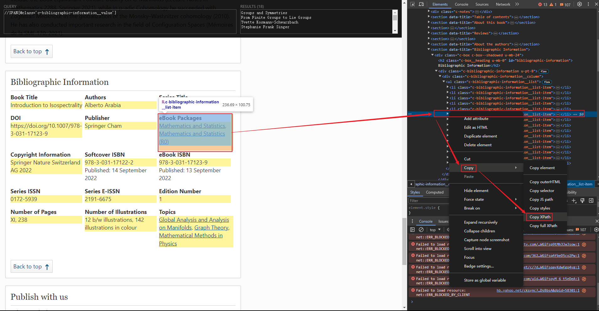
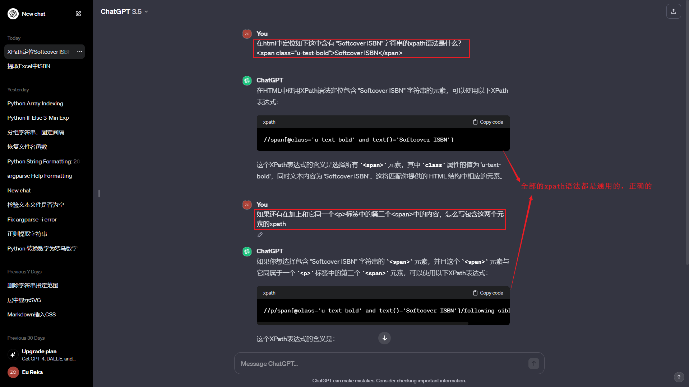
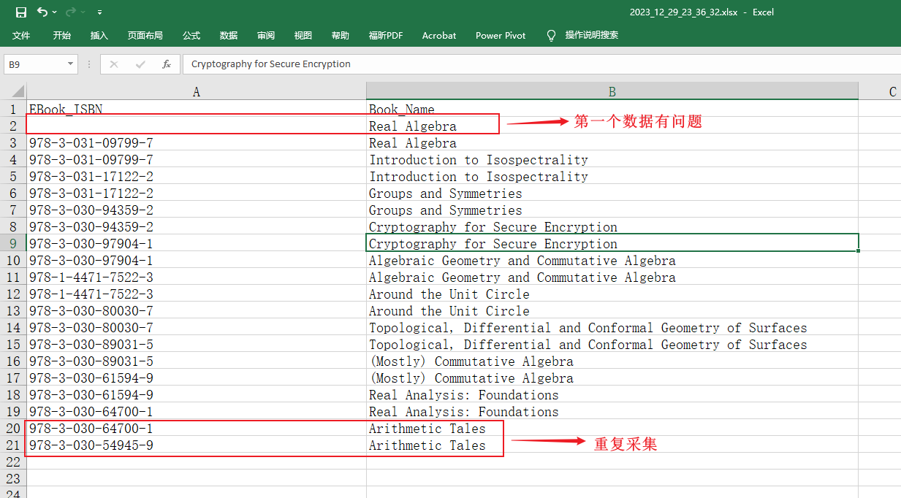
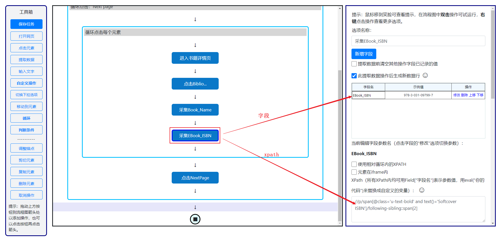
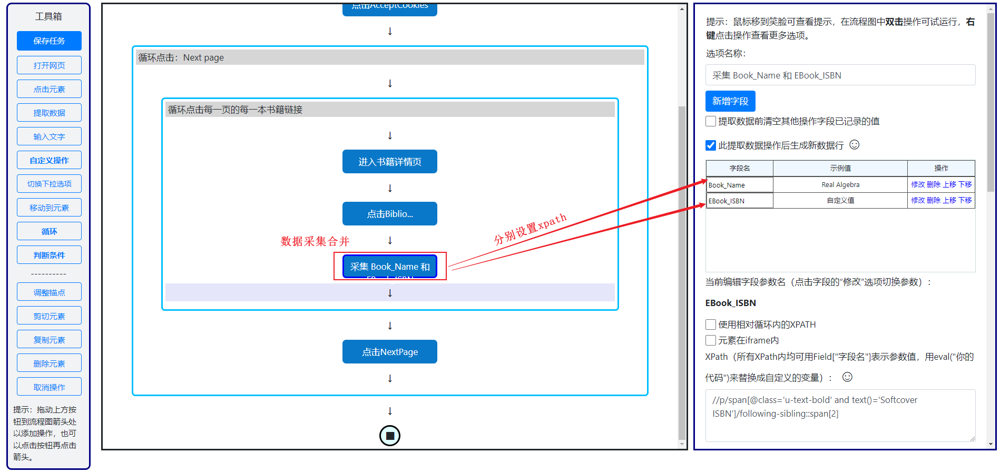
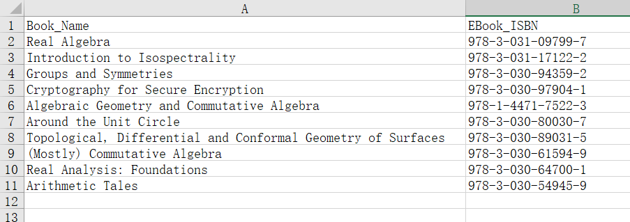

# 总体原则

* 第一遍选取元素是确定循环的定义域(生成行，每一次循环一行)
* 选择子元素是对每一个循环的元素进行分类(生成列，对应不同的参数)

其实你可以分多次采集单个元素，然后把每一个元素对应的参数名字改为你希望的列名称即可.


# 元素定位

## 手动

使用Chrome自带的调试功能，复制对应元素的FullXpath，示意图如下:




## 元素定位错误

比如下面这个元素定位错误的案例，以下的日志来自easyspider的运行命令行：

```text
Loop element not found:  /html/body/div[2]/div[3]/main[1]/section[9]/div[1]/div[1]/div[1]/ul[1]/li/p[1]
找不到循环元素： /html/body/div[2]/div[3]/main[1]/section[9]/div[1]/div[1]/div[1]/ul[1]/li/p[1]
Book Title : Cr
eBook ISBN : 97
Loop element not found:  /html/body/div[2]/div[3]/main[1]/section[9]/div[1]/div[1]/div[1]/ul[1]/li/p[1]
找不到循环元素： /html/body/div[2]/div[3]/main[1]/section[9]/div[1]/div[1]/div[1]/ul[1]/li/p[1]
Book Title : Ar
eBook ISBN : 97
Loop element not found:  /html/body/div[2]/div[3]/main[1]/section[9]/div[1]/div[1]/div[1]/ul[1]/li/p[1]
找不到循环元素： /html/body/div[2]/div[3]/main[1]/section[9]/div[1]/div[1]/div[1]/ul[1]/li/p[1]
```

可以发现第一个元素，第三个元素定位失败, 然后此时去查看我们程序中的xpath，如下：

```
/html/body/div[2]/div[3]/main[1]/section[9]/div[1]/div[1]/div[1]/ul[1]/li/p[1]
```

然而Chrome中的fullxpath为：

```text
/html/body/div[3]/div[3]/main[1]/section[9]/div[1]/div[1]/div[1]/ul[1]/li/p[1]
```

进一步其实我们可以发现第五个元素的正确位置如下:

```text
/html/body/div[2]/div[3]/main[1]/section[8]/div[1]/div[1]/div[1]/ul[1]/li/p[1]
```


> 以上的元素没有发现明显的规律，即使是使用`last()`等变量也不能够是的我们的xpath具有普适性


## 一个有用的元素定位方法

我们在前端的html代码中发现了这样的东西:

```html
// 第一段代码节选
<li class="c-bibliographic-information__list-item">
    <p class="">
        <span class="u-text-bold">Authors</span>
        <span class="u-hide">: </span>
        <span class="c-bibliographic-information__value xh-highlight" data-component="book-contributor-list" data-list-type="authors">Yvette Kosmann-Schwarzbach</span>
    </p>
</li>


// 第二段代码节选
<li class="c-bibliographic-information__list-item">
    <p class="">
        <span class="u-text-bold">Translated by</span>
        <span class="u-hide">: </span>
        <span class="c-bibliographic-information__value xh-highlight" data-component="book-contributor-list" data-list-type="translators">Stephanie Frank Singer</span>
    </p>
</li>

// 还有很多 ...
```


上述的每一个代码片段（和我们采集的元素1-1对应）都有一个如下的东西:

```html
class="c-bibliographic-information__value xh-highlight"
```

所以我们有了如下的`通用`元素定位方法, 也即xpath语法:

```xpath
//SPAN[@class='c-bibliographic-information__value']
```


关于更多xpath的语法可以询问GPT，毕竟没要为了学一个xpath花费过大的精力,我的询问过程如下:



由于我只需要提取一个书籍的名字和对应的ISBN，所以对应的两个元素的xpath语法就比较简单了.

```xpath
//p/span[@class='u-text-bold' and text()='Book Title']/following-sibling::span[2]
//p/span[@class='u-text-bold' and text()='eBook ISBN']/following-sibling::span[2]
```


## 运行结果

最终的运行结果

```
加载页面|Loading page: https://www.springer.com/series/223/books?page=2
  Real Algebra
978-3-031-09799  Real Algebra
978-3-031-09799  Introduction to
978-3-031-17122  Introduction to
978-3-031-17122  Groups and Symm
978-3-030-94359  Groups and Symm
978-3-030-94359  Cryptography fo
978-3-030-97904  Cryptography fo
978-3-030-97904  Algebraic Geome
978-1-4471-7522  Algebraic Geome
978-1-4471-7522  Around the Unit
978-3-030-80030  Around the Unit
978-3-030-80030  Topological, Di
978-3-030-89031  Topological, Di
978-3-030-89031  (Mostly) Commut
978-3-030-61594  (Mostly) Commut
978-3-030-61594  Real Analysis:
978-3-030-64700  Real Analysis:
978-3-030-64700  Arithmetic Tale
978-3-030-54945  Arithmetic Tale
Page:  1
Done!
执行完成！
任务执行完毕，将在60秒后自动退出浏览器并清理临时用户目录，等待时间可在保存任务对话框中设置。
The task is completed, the browser will exit automatically and the temporary user directory will be cleaned up after 60 seconds, the waiting time can be set in the save task dialog.
```

但是现在有一个问题，就是一个数据采集了两次，采集到的数据如下:



而目前我的EasySpider的数据采集流程图如下:



做了如下修改，把对应的两个步骤的数据采集合并到一个步骤:



> 点击每一个`字段`对应的`修改`选项，然后在下面设置其对应的xpath值

最终一切正常,运行日志如下:

```log
加载页面|Loading page: https://www.springer.com/series/223/books?page=2
Real Algebra  978-3-031-09799
Introduction to  978-3-031-17122
Groups and Symm  978-3-030-94359
Cryptography fo  978-3-030-97904
Algebraic Geome  978-1-4471-7522
Around the Unit  978-3-030-80030
Topological, Di  978-3-030-89031
(Mostly) Commut  978-3-030-61594
Real Analysis:   978-3-030-64700
Arithmetic Tale  978-3-030-54945
Page:  1
Done!
执行完成
```

采集到的数据格式如下:




## 任务代码

最终的完整任务对应的JSON代码链接地址为:

https://gitee.com/zongpingding/source-public/blob/master/EasySpider/works_II.json

> 这里所用的EasySpider版本为 `0.6.0`


## 无头模式

其实就是不打开浏览器的图形界面，让采集工作在后台进行, 只需要在运行任务是进行如下的选择即可:


运行结果如下:

```shell
./EasySpider/resources/app/chrome_win64/easyspider_executestage.exe --ids [1] --user_data 0 --server_address http://localhost:8074 --config_folder "C:/Program Files/EasySpider_windows_0.6.0/" --headless 1 --read_type remote --config_file_name config.json --saved_file_name

加载页面|Loading page: https://www.springer.com/series/223/books?page=2
Real Algebra  978-3-031-09799  Manfred Knebusc
Introduction to  978-3-031-17122  Alberto Arabia
Groups and Symm  978-3-030-94359  Yvette Kosmann-
```

> 为了在终端下正常运行，建议设置以下终端对应的代理，不然你就会看到如下的报错,你的运行日志可能就是下面这样的:
>
> ```
> 加载页面|Loading page: https://www.springer.com/series/223/books?page=2
> [1230/002447.445:ERROR:ssl_client_socket_impl.cc(975)] handshake failed; returned -1, SSL error code 1, net_error -100
> Real Algebra  978-3-031-09799  Manfred Knebusc
> [1230/002457.760:ERROR:ssl_client_socket_impl.cc(975)] handshake failed; returned -1, SSL error code 1, net_error -100
> [1230/002457.882:ERROR:ssl_client_socket_impl.cc(975)] handshake failed; returned -1, SSL error code 1, net_error -100
> Introduction to  978-3-031-17122  Alberto Arabia
> [1230/002505.418:ERROR:ssl_client_socket_impl.cc(975)] handshake failed; returned -1, SSL error code 1, net_error -100
> [1230/002507.715:ERROR:ssl_client_socket_impl.cc(975)] handshake failed; returned -1, SSL error code 1, net_error -100
> [1230/002507.830:ERROR:ssl_client_socket_impl.cc(975)] handshake failed; returned -1, SSL error code 1, net_error -100
> ```

然后复制上面的代码：

```shell
./EasySpider/resources/app/chrome_win64/easyspider_executestage.exe --ids [1] --user_data 0 --server_address http://localhost:8074 --config_folder "C:/Program Files/EasySpider_windows_0.6.0/" --headless 1 --read_type remote --config_file_name config.json --saved_file_name
```

注意：我在这里更改了两个参数

* --headless 1: 也就是不开启浏览器界面，在背后执行
* --read_type remote：不用开启EasySpider执行这个爬取任务

> remote时，必须强制关闭之前的所有EasySpider实例，不然就会报错
> ```
> Failed to execute script 'easyspider_executestage' due to unhandled exception!
> ```

同样的，在执行定时任务时也必须关闭这个EasySpider的所有相关进程。

## 代码修改

~~一些代码修改，由于最新的`0.6.0`版本有部分的错误，于是需要对文件`easyspider_executestage.py`的`2263`行附近做出修改.原始代码如下~~:

```python
options.binary_location = "./chrome.exe"  # 指定chrome位置
driver_path = "./chromedriver.exe"
options.add_extension("XPathHelper.crx")
```

~~一般情况下这个python文件位于:~~

```
C:\Program Files\EasySpider_windows_0.6.0\Code\easyspider_executestage.py
```

~~这个默认的`easyspider_executestage.exe`可执行文件在我的电脑上，同目录下有如下文件:~~

```text
// pwd -- c/Program Files/EasySpider_windows_0.6.0/EasySpider/resources/app/chrome_win64
.
├── 120.0.6099.71
├── chromedriver_win64.exe
├── chrome.exe
├── chrome_proxy.exe
├── chrome.VisualElementsManifest.xml
├── Data
├── Dictionaries
├── easyspider_executestage.exe
├── execute.bat
├── initial_preferences
├── SetupMetrics
└── stealth.min.js
```

~~我们主要对这个目录还有源码文件`easyspider_executestage.py`做出如下两个小的改动:~~

* ~~把原始的代码中的`chromedriver.exe`改为`chromedriver64.exe`（根据自己对应目录下的名称进行修改）~~

  ```python
  options.binary_location = "./chrome.exe"  # 指定chrome位置
  driver_path = "./chromedriver_win64.exe"
  options.add_extension("XPathHelper.crx")
  ```

* ~~把`XPathHelper.crx`复制一份到如下的目录(其实就是和`easyspider_executestage.exe`同目录)~~
  ```text
  C:/Program Files/EasySpider_windows_0.6.0/EasySpider/resources/app/
  ```

  ~~默认的这个crx拓展的位置应该是在:~~

  ```
  C:/Program Files/EasySpider_windows_0.6.0/EasySpider/resources/app/XPathHelper.crx
  ```

~~修改之后即可一切正常,运行日志如下:~~

```log
PC in EasySpider
❯ .\EasySpider.ps1

Configurations:
+------------------+------+--------------------------------------------+
|       Key        | Type | Value                                      |
+------------------+------+--------------------------------------------+
|       ids        | list | [1]                                        |
| saved_file_name  | str  |                                            |
|    user_data     | bool | False                                      |
|  config_folder   | str  | C:/Program Files/EasySpider_windows_0.6.0/ |
| config_file_name | str  | config.json                                |
|    read_type     | str  | local                                      |
|     headless     | bool | True                                       |
|  server_address  | str  | http://localhost:8074                      |
|     keyboard     | bool | True                                       |
|    pause_key     | str  | p                                          |
|     version      | str  | 0.6.0                                      |
+------------------+------+--------------------------------------------+

win32 ('64bit', 'WindowsPE')
Finding chromedriver in EasySpider C:\Program Files\EasySpider_windows_0.6.0/EasySpider
Chrome location: C:\Program Files\EasySpider_windows_0.6.0\EasySpider/resources/app/chrome_win64/chrome.exe
Chromedriver location: C:\Program Files\EasySpider_windows_0.6.0\EasySpider/resources/app/chrome_win64/chromedriver_win64.exe
Config file path: C:/Program Files/EasySpider_windows_0.6.0/config.json
Headless mode
无头模式
如果报错Selenium.common.exceptions.WebDriverException: Message: unknown error: Chrome failed to start: exited abnormally，说明有之前运行的Chrome实例没有正常关闭，请关闭之前打开的所有Chrome实例后再运行程序即可。
If you get an error Selenium.common.exceptions.WebDriverException: Message: unknown error: Chrome failed to start: exited abnormally, it means that there is a Chrome instance that was not closed properly before, please close all Chrome instances that were opened before running the program.
id:  1
local
Task Name: Universitext ISBN
任务名称: Universitext ISBN
Data path: C:\Program Files\EasySpider_windows_0.6.0\Data\Task_1

DevTools listening on ws://127.0.0.1:1186/devtools/browser/b84755a9-40d6-4540-8558-cde9e9228d80
任务ID 1 的保存文件名为: 2023_12_30_03_01_58
Save Name for task ID 1 is: 2023_12_30_03_01_58
此模式下，任务ID 1 将从头F开始执行，如果需要从上次退出的步骤开始执行，请在保存任务时设置是否从上次保存位置开始执行为“是”。
In this mode, task ID 1 will start from the beginning, if you want to start from the last step, please set the option 'start from the last step' to 'yes' when saving the task.
Loading stealth.min.js
新建模式|Create Mode
循环操作<循环采集数据>可以快速提取数据
Loop operation <循环采集数据> can extract data quickly
循环操作<循环采集数据>可以快速提取数据
Loop operation <循环采集数据> can extract data quickly
循环操作<循环采集数据>可以快速提取数据
Loop operation <循环采集数据> can extract data quickly
循环操作<循环采集数据>可以快速提取数据
Loop operation <循环采集数据> can extract data quickly
循环操作<循环采集数据>可以快速提取数据
Loop operation <循环采集数据> can extract data quickly
循环操作<循环采集数据>可以快速提取数据
Loop operation <循环采集数据> can extract data quickly
循环操作<循环采集数据>可以快速提取数据
Loop operation <循环采集数据> can extract data quickly
循环操作<循环采集数据>可以快速提取数据
Loop operation <循环采集数据> can extract data quickly
循环操作<循环采集数据>可以快速提取数据
Loop operation <循环采集数据> can extract data quickly
循环操作<循环采集数据>可以快速提取数据
Loop operation <循环采集数据> can extract data quickly
循环操作<循环采集数据>可以快速提取数据
Loop operation <循环采集数据> can extract data quickly
循环操作<循环采集数据>可以快速提取数据
Loop operation <循环采集数据> can extract data quickly
预处理完成|Preprocess completed
Thread with task id:  1  is created
正在执行第 1 / 1 个链接
Executing link 1 / 1


----------------------------------
正在运行任务，长按键盘p键可暂停任务的执行以便手工操作浏览器如输入验证码；如果想恢复任务的执行，请再次长按p键。
Running task, long press 'p' to pause the task for manual operation of the browser such as entering the verification code; If you want to resume the execution of the task, please long press 'p' again.
----------------------------------


加载页面|Loading page: https://www.springer.com/series/223/books?page=2
检测到页面变化，继续循环。
Page changed detected, continue loop.
Real Algebra  Manfred Knebusc  978-3-031-09800  Published: 22 O
Introduction to  Alberto Arabia  978-3-031-17123  Published: 13 S
Groups and Symm  Yvette Kosmann-  978-3-030-94360  Published: 16 J
Cryptography fo  Robert G. Under  978-3-030-97902  Published: 03 J
Algebraic Geome  Siegfried Bosch  978-1-4471-7523  Published: 22 A
Around the Unit  James McKee, Ch  978-3-030-80031  Published: 08 D
Topological, Di  Norbert A'Campo  978-3-030-89032  Published: 27 O
(Mostly) Commut  Antoine Chamber  978-3-030-61595  Published: 08 A
```

> ~~目前有一个Bug：即使集成在Terminal中的Powershell不能正常运行，但是默认的不加任何配置的Powershell一切正常. 报错如下：~~
>
> ```log
> PC in EasySpider
> ❯ .\EasySpider.ps1
> 
> Configurations:
> +------------------+------+--------------------------------------------+
> |       Key        | Type | Value                                      |
> +------------------+------+--------------------------------------------+
> |       ids        | list | [1]                                        |
> | saved_file_name  | str  |                                            |
> |    user_data     | bool | False                                      |
> |  config_folder   | str  | C:/Program Files/EasySpider_windows_0.6.0/ |
> | config_file_name | str  | config.json                                |
> |    read_type     | str  | local                                      |
> |     headless     | bool | True                                       |
> |  server_address  | str  | http://localhost:8074                      |
> |     keyboard     | bool | True                                       |
> |    pause_key     | str  | p                                          |
> |     version      | str  | 0.6.0                                      |
> +------------------+------+--------------------------------------------+
> 
> win32 ('64bit', 'WindowsPE')
> Finding chromedriver in EasySpider C:\Program Files\EasySpider_windows_0.6.0/EasySpider
> Chrome location: C:\Program Files\EasySpider_windows_0.6.0\EasySpider/resources/app/chrome_win64/chrome.exe
> Chromedriver location: C:\Program Files\EasySpider_windows_0.6.0\EasySpider/resources/app/chrome_win64/chromedriver_win64.exe
> Config file path: C:/Program Files/EasySpider_windows_0.6.0/config.json
> Headless mode
> 无头模式
> 如果报错Selenium.common.exceptions.WebDriverException: Message: unknown error: Chrome failed to start: exited abnormally，说明有之前运行的Chrome实例没有正常关闭，请关闭之前 打开的所有Chrome实例后再运行程序即可。
> If you get an error Selenium.common.exceptions.WebDriverException: Message: unknown error: Chrome failed to start: exited abnormally, it means that there is a Chrome instance that was not closed properly before, please close all Chrome instances that were opened before running the program.
> id:  1
> local
> Task Name: Universitext ISBN
> 任务名称: Universitext ISBN
> Data path: C:\Program Files\EasySpider_windows_0.6.0\Data\Task_1
> Traceback (most recent call last):
>   File "easyspider_executestage.py", line 2400, in <module>
>   File "myChrome.py", line 26, in __init__
>   File "selenium\webdriver\chrome\webdriver.py", line 45, in __init__
>   File "selenium\webdriver\chromium\webdriver.py", line 61, in __init__
>   File "selenium\webdriver\remote\webdriver.py", line 209, in __init__
>   File "selenium\webdriver\remote\webdriver.py", line 293, in start_session
>   File "selenium\webdriver\remote\webdriver.py", line 348, in execute
>   File "selenium\webdriver\remote\errorhandler.py", line 193, in check_response
> selenium.common.exceptions.WebDriverException: Message:
> 
> [4276] Failed to execute script 'easyspider_executestage' due to unhandled exception!
> 
> Cannot automatically check new version, please use the following command to check whether a new version avaliable and upgrade by pip:
> pip index versions commandline_config
> pip install commandline --upgrade
> ```
>
> ~~这个报错就很离谱,说我的pip 的包有问题 >_<~~


## bug 最终原因

不能使用clash手动开代理，也就是不能把下面的内容复制到powershell中执行:

```
$Env:http_proxy="http://127.0.0.1:7127";$Env:https_proxy="http://127.0.0.1:7127"
```

`所以上面那两个都不用改了`


## 一些易错点

* Nextpage按钮位置变了，比如默认给的定位`nextpage`按钮xpath语法为

  ```xpath
  //*[contains(@class, "c-pagination")]/li[9]/a[1]/span[1]/span[1]
  ```

  但是当页面变化后，一般这个按钮的位置是会改变的，我这里就是，他在`page=4`那一页就变成了第十个，所以通用的语法，我一般选择下面这个:

  ```xpath
  //span[contains(., 'Next page')]
  ```

* 关于xpath定位中的多重判断，其实我上面那个用于定位eBook ISBN的xpath只用写一个判断就行了:

  ```
  //p/span[text()='eBook ISBN']/following-sibling::span[2]
  ```


## 整个项目源代码


